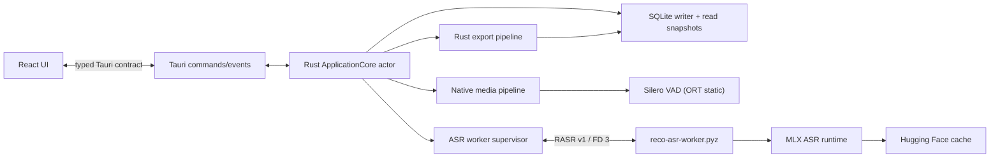

# RecoGUI アプリケーション設計

## 文書の役割

この文書は、Rust をアプリケーション本体、Python を ASR 専用 worker とする責務境界と不変条件を定義する。
製品要件は [requirements.md](requirements.md)、検証は [validation.md](validation.md) を正本とする。実装履歴は
Git commit で管理し、恒久的な task/change-log 文書は追加しない。

## システム構成



`ApplicationCore` は単一 actor として active session、run ID、queue auto advance、model lease、pipeline、Export、
close/sleep を直列化する。decode、resample、VAD、ASR、Export などの重い処理は actor 外で実行し、
`sessionId + runId + jobId` を付けて結果を戻す。actor は stale run の結果を破棄し、DB commit と event 発行の順序を管理する。

### 責務境界

| コンポーネント | 所有する責務 |
| --- | --- |
| React | 表示、選択、検索 filter、focus、keyboard、transient UI state |
| Tauri bridge | 生成済み typed command/event の公開、`app://event` の配信 |
| Rust `ApplicationCore` | session/queue lifecycle、状態 CAS、model lease、pipeline、shutdown、sleep、Export orchestration |
| Rust SQLite store | schema v5 の検証、専用 writer、read snapshot、履歴/検索/queue/model 設定、segment transaction |
| Rust media pipeline | native file decode、microphone/systemAudio capture、normalizer、fingerprint、VAD、bounded ASR queue |
| Rust worker supervisor | worker process、FD 3 socket、Hello/heartbeat、request correlation、終了・kill |
| Python `reco_worker` | HF cache/revision 解決、MLX model load/unload、単一 speech segment の transcription |
| Hugging Face cache | 既存 model snapshot/revision の保存場所 |

Python worker は DB、queue、path、VAD asset、Export、Tauri、UI event を認識しない。Rust から渡される ID は opaque 値を
echo するだけである。旧 engine/repository/sidecar/file/VAD 層、互換 adapter、fallback、feature flag、dual write は設けない。

## ディレクトリと資産

```text
RecoGUI/
├── src/                         # React / TypeScript
├── src/generated/bindings.ts    # Specta が生成する tracked contract
├── src-python/
│   ├── src/reco_worker/         # ASR-only worker package
│   ├── tests/                   # worker/protocol tests
│   └── dist/reco-asr-worker.pyz # code-only archive
├── src-tauri/
│   ├── src/                     # domain, store, media, core, supervisor, commands
│   └── resources/models/silero_vad.onnx
├── protocol/fixtures/            # cross-language RASR v1 fixtures
└── docs/
```

ONNX asset の SHA-256 は起動時に検証する。Rust 側の resource から直接読み、Application Support へコピーしない。
Python archive は `uv run --frozen --no-dev` で on-demand 起動する。source、test、`.venv` は bundle に含めない。

## Domain、SQLite、状態遷移

`ApplicationCore` の actor state は active slot、monotonic run ID、queue revision、event sequence、model lease、
pipeline handle、close state を保持する。公開される u64 値（rowVersion、queue revision、event sequence）は decimal string。

SQLite は `rusqlite 0.40.1` bundled SQLite を使用する。専用 writer thread が write connection を一つだけ所有し、
短命 read-only snapshot connection が履歴、検索、Export を読む。WAL、`synchronous=FULL`、foreign keys、busy timeout を
設定する。schema user_version は 5 でなければ拒否し、必須 table/index、保存 JSON、integrity check を検証する。暗黙 migration はしない。

一般化された `set_state` は作らない。状態ごとに期待する遷移元を `WHERE` に指定した CAS メソッドを用い、競合時は stale error を返す。
segment、集計値、検出言語、row version は一 transaction で保存し、commit 成功後にのみ `segment.committed` と snapshot 更新を通知する。
起動時には `preparing/running/pausing/stopping` だけを一 transaction で `abandoned` へ回収し、paused、file failure、queue、選択 model は保持する。

保存する file の path/fingerprint、microphone UID、model repository/revision、language、`config_json`、checkpoint、segment count は
Resume のためだけに使う。React へ path を公開しない。queue claim は item 削除、preparing session 作成、queue revision 更新を一 transaction で行う。

## Native media pipeline

ファイルは Symphonia 0.6.0 で decode する。dialog の対応拡張子は `aac,aif,aiff,caf,flac,m4a,mp3,ogg,wav` だけとし、
container/codec probe を通過した入力を許可する。Rust の `rubato 4.0.0` normalizer を file、microphone、systemAudio で共有し、
16 kHz mono `f32`、512 sample frame へ変換する。ASR queue の容量は 2、segment は最大 60 秒/3,840,000 bytes。

microphone は platform UID を使って Rust が stream を開く。systemAudio は Core Audio Process Tap と private aggregate device を
RAII で所有し、RecoGUI 自身の process を除外する。callback は allocation/blocking/log を行わず SPSC ring へコピーする。
ring overflow、device disconnect、sequence gap、capture failure は session failure とし、sample を捨てて継続しない。

Silero VAD は `ort = 2.0.0-rc.12` の CPU static execution provider を使う。64-frame context、512-frame input、hysteresis、adaptive split、
padding、60 秒上限、flush を Rust へ移植し、既存 fixture と確率誤差 `1e-5` 以内で一致させる。Python VAD fallback は実装しない。

## ASR worker protocol と supervisor

Rust は worker の標準入力/出力を protocol に使わず、FD 3 の Unix socket を全二重で使用する。各 frame は little-endian の 16-byte header と
JSON/binary payload で構成する。

```text
bytes 0..4   magic = "RASR"
u16          version = 1
u16          frameKind = Hello | Request | Response | Heartbeat
u32          jsonLength (<= 65536)
u32          binaryLength (<= 4194304)
```

worker は起動時に Hello を返し、heartbeat は 2 秒間隔で送る。10 秒通信がなければ supervisor は unresponsive として session を失敗させる。
request は一時に一つだけ処理し、request ID の重複、未知 field/operation、version 不一致、length 不整合、過大 frame、途中 EOF は protocol fatal とする。
operation は `models.list`、`model.load`、`segment.transcribe`、`model.unload`、`shutdown` に限定する。model load/inference に固定 45 秒 timeout は設けない。

supervisor は process lifecycle、Hello、heartbeat、request/response correlation、graceful shutdown、必要時の kill を担当する。
model一覧取得だけの worker は終了できる。active session/queue 中は同じ model lease を再利用し、Pause、完了、停止後に unload して process を終了する。

## Lifecycle sequence

### Start

1. Rust が source、permission、device/tap、selected model を preflight する。失敗時は row を作らない。
2. writer transaction で `preparing` row を作成する。
3. worker の model load と native source 開始を actor 外で実行する。
4. 両方の成功を検証して CAS で `running` へ移し、`session.upserted` を発行する。

### Segment commit

1. VAD が speech segment を確定し、Rust が segment index と job ID を採番する。
2. bounded queue から worker へ PCM を送る。
3. response の session/run/job/index を検証し、順序外または stale response を破棄する。
4. text、language、aggregate、row version を一 transaction で保存し、成功後に `segment.committed` を発行する。

### Pause/Stop

queue auto advance を止め、状態を `pausing`/`stopping` へ CAS してから source 停止、normalizer drain、VAD flush、ASR drain、segment commit を行う。
Pause は checkpoint 付き `paused` を保存後に active slot 解放と model unload を行う。Stop は source が live なら `completed`、file なら `stopped`、
app quit/system sleep は常に `stopped` を保存する。

### Resume、failure、close

Resume は保存 config/model/revision/language/checkpoint/device identity を厳密に使う。旧 run の結果は無視する。worker crash は live を非再開可能 `failed`、
file を最後の commit 位置から retry 可能な `failed` とし、queue auto advance を止める。close は queue 停止、session drain、Export cancel、DB commit、capture release、
worker shutdown の完了後に native close を許可する。sleep は active session を `systemSleep` stop し、wake 後は再開しない。

## Typed Tauri contract と UI event

公開 command は `app_get_snapshot`、`model_list`、`model_select`、`audio_list_inputs`、session start/pause/resume/stop、queue get/add/reorder/remove/clear/start/pause、
history query/get/rename/delete/render、export start/cancel、`host_resolve_close` だけとする。queue_add_files と export_start の native dialog は Rust 内で開く。

`tauri-specta 2.0.0-rc.25`、`specta 2.0.0-rc.25`、`specta-typescript 0.0.12` で bindings を生成し、write mode と `--check` mode を分離する。起動時生成はしない。
`engine_request`、generic allowlist、`serde_json::Value` payload、`Raw*` 型、`unknown` payload、manual status cast、FileTokenStore は削除する。

event channel は `app://event` 一つとし、`session.upserted`、`segment.committed`、`session.progress`、`sessions.deleted`、`queue.changed`、`model.changed`、
`export.progress`、`export.finished`、close events、`notification.error` の discriminated union を送る。React は購読を開始して snapshot を取得し、snapshot より新しい
buffer だけを適用する。sequence gap または rowVersion の逆行を検知したら snapshot を再取得する。

## Export と resources

Export は Rust の read-only snapshot から生成する。`zip 8.6.0` で複数 session の ZIP を作り、同一 directory の staging に書く。finish、flush、`sync_all` 後に atomic publish し、
cancel/error 時は staging のみ削除する。既存 destination は成功した publish 以外では変更しない。Symphonia、ORT、rusqlite/SQLite、zip、Specta の license notice を bundle に含める。

## 設計変更の gate

protocol、schema、media format、lifecycle、event/command DTO の変更は、requirements、実装、cross-language fixture、validation を同じ変更境界で更新する。
旧 protocol の互換経路、Python/Rust 共有 DB、dual write、runtime feature flag を追加してはならない。完了時に旧名称と責務（`RecoEngine`、`RecordingRepository`、`SidecarServer`、
`HostPcmBroker`、`engine_request`）が検索結果に残っていないことを確認する。
