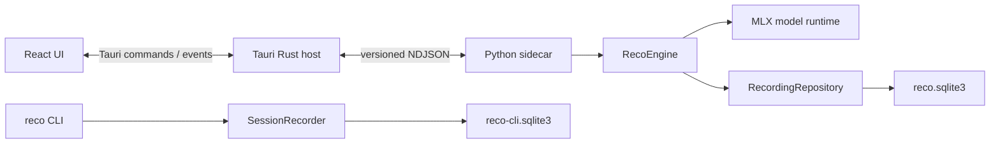

# RecoGUI アプリケーション設計

## 文書の役割

この文書は、現行実装の責務境界と、変更時に維持すべき設計上の不変条件を示す。
製品要件は [requirements.md](requirements.md)、検証方法は [validation.md](validation.md) を正本とする。

## システム構成



### 責務

| 層 | 責務 |
| --- | --- |
| React | 画面表示、選択、検索条件、dialog、pane幅などの表示状態 |
| Rust | OS連携、path token、sidecar監督、lifecycle、許可commandの制限 |
| Python sidecar | NDJSONの検証、command dispatch、event送信、非同期処理の管理 |
| RecoEngine | GUI向け文字起こし、model lifecycle、active sessionの管理 |
| RecordingRepository | GUI用SQLite、履歴、検索、削除、Export、migration |
| reco CLI | 従来のCLI操作とGUIから独立した文字起こし、保存 |

GUIとCLIは音声処理の基礎コードを共有するが、同じengine instanceやdatabase schemaを使用しない。
GUIの永続化契約を変更するときは、CLIの保存動作への影響を別途確認する。

## リポジトリ構成

```text
RecoGUI/
├── protocol/       # NDJSON schemaと共通fixture
├── scripts/        # protocol検証などのリポジトリ用script
├── src/            # React / TypeScript
├── src-python/     # Python engine、CLI、test、import元の記録
├── src-tauri/      # Rust host、Tauri設定、sidecar launcher
├── docs/
└── package.json    # 開発と検証の共通入口
```

元のReco repositoryは参照元として保持し、変更しない。コピー元は
`src-python/SOURCE.md`に記録し、RecoGUI内のコードを以後の正本とする。

## 状態と永続化

### 状態の正本

| 状態 | 正本 |
| --- | --- |
| sidecar processの起動、停止、crash、再起動 | Rust |
| modelとactive session | Python engine |
| 保存済みsession、segment、集計値 | GUI用SQLite |
| 選択、dialog、検索条件、pane幅 | React |

Reactは永続的な処理状態を独自に確定しない。起動、再接続、終端eventの後はengineと履歴から
canonical stateを取得する。

### 保存の不変条件

1. `session.start`では、音声取得前にsession rowを作成する。
2. segmentと集計値を一つのtransactionで保存する。
3. 保存成功後にだけ`segment.persisted`を送信する。
4. terminal stateを保存してから完了または失敗eventを送信する。
5. 保存を継続できない場合、未保存の認識結果だけを表示し続けない。

各sessionは`row_version`を持つ。Reactは`rowVersion`が古いresponseやeventを無視し、
segmentを`(sessionId, segmentIndex)`で統合する。同じeventが複数回届いても同じsegmentを
重複表示しない。

詳細のpage取得中に`rowVersion`が変化した場合は、先頭から読み直して一貫したsnapshotを作る。

### 終了と復旧

- Stopは入力を閉じ、処理待ちをdrainし、terminal stateを保存する。
- Cancelは未処理queueを打ち切り、保存済みsegmentを残して終了する。
- 前回processの非終端sessionは起動時に`abandoned`へ変更する。
- sidecarが応答しない場合、Rustはprocessを終了できる。保存済み部分は履歴に残る。
- sleepやwake後にマイク録音を無断で再開しない。

## IPC

RustとPython sidecarはstdin/stdout上のUTF-8 NDJSONで通信する。

- stdoutはprotocol専用、stderrはlog専用とする。
- messageには`protocolVersion`、`requestId`、`sequence`を持たせる。
- sessionに関係するmessageには`sessionId`を持たせる。
- protocol version、sequence、request correlation、message sizeを検証する。
- Reactから呼べる操作はRustの個別Tauri commandに限定する。
- Rust側の`ALLOWED_ENGINE_COMMANDS`をhostからsidecarへ送信できるcommandの正本とする。

### Commands

```text
engine.getState
engine.shutdown
model.getState
model.download
model.cancelDownload
model.verify
model.load
model.delete
audio.listInputs
session.start
session.stop
session.cancel
history.list
history.get
history.search
history.delete
history.deleteMany
history.export
history.exportMany
history.cancelExport
```

### Events

```text
engine.heartbeat
model.loading
model.downloadProgress
model.ready
session.progress
session.stateChanged
segment.persisted
session.completed
session.failed
history.changed
export.progress
export.completed
operation.failed
engine.exited
```

`host://close-requested`と`host://close-force-required`はengine protocolではなく、
application終了を調停するhost eventである。

event payloadを変更するときは、Python、Rust、TypeScriptと`protocol/fixtures/`を同時に更新する。

## SQLite

GUI用databaseはTauriのapplication data directoryにある`reco.sqlite3`とする。
RustとReactはこのdatabaseを直接開かない。

- `app_sessions`と`app_segments`を中心に保存する。
- `app_session_search`のFTS5 indexで履歴を検索する。
- foreign keysと`ON DELETE CASCADE`でsessionとsegmentの整合性を保つ。
- WAL、busy timeout、durabilityを優先するsynchronous設定を使用する。
- migrationはtransaction内で適用し、事前backupと適用後の検査を行う。
- Exportは一貫した読み取り結果から作り、一時pathから最終pathへ置き換える。

CLIは同じapplication support領域の`reco-cli.sqlite3`を使用する。GUI用databaseとの統合や相互表示は
現在の契約に含めない。

## UI

- 左の履歴paneと右のsession paneを常設する。
- 履歴paneは280pxから420pxの範囲でpointerとkeyboardから変更できる。
- 処理中sessionを表示したまま別の履歴を閲覧できる。
- 単一選択と複数選択を分け、複数選択では一括Exportと削除を提供する。
- 削除前に確認し、処理中sessionは先にStopまたはCancelする。
- live transcriptの自動追従は、ユーザーが上へscrollしたとき停止する。
- dialogを閉じた後は呼び出し元へfocusを戻す。
- 状態とerrorを色だけで表現しない。
- animationは`prefers-reduced-motion`を尊重する。

## ファイルとモデル

Rustはnative dialogで選択したpathをtoken化し、Reactへ任意pathの権限を渡さない。
Pythonへ渡す前にもtokenと操作内容を検証する。

- マイクの元音声は保存しない。
- 入力ファイルの絶対pathは履歴へ保存しない。
- modelは固定revisionをapplication data directoryの`models/`へ保存する。
- logはapplication data directoryの`logs/`へ保存する。
- 履歴削除は入力元ファイルや既存のExportを削除しない。

## 変更時の確認事項

- protocol変更: schema、fixture、Python、Rust、TypeScriptを更新する。
- 保存変更: commit-before-display、row version、cascade delete、crash recoveryを確認する。
- UI変更: keyboard操作、focus復元、selection維持、reduced motionを確認する。
- lifecycle変更: sidecar exit、hang、sleep、close、restartを確認する。
- CLI変更: GUIとは別経路、別databaseであることを前提に互換性を確認する。
