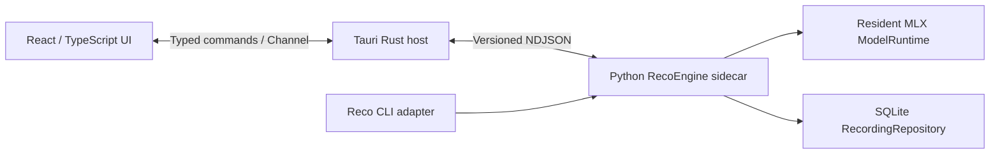

# RecoGUI アプリケーション設計

## 文書の位置付け

この文書は、RecoGUI の完成形を定義する設計資料である。実装手順や一時的な簡略版ではなく、
アプリケーション全体の責務、データの正本、画面構成、プロセス間通信、保存、削除、Export、
障害復旧の基準を示す。

添付された参考画面は、左側に履歴、右側に選択した内容を表示する構造だけを参考にする。
配色、文字組み、アイコン、操作の隠し方を模写するものではない。

## 確定している設計方針

- GUI は Tauri v2、React、TypeScript で構築する。
- Rust は OS 連携と Python sidecar の監督を担当する。
- Python は音声入力、VAD、MLX ASR、セッション状態、SQLite を担当する。
- Rich の端末出力は解析せず、型付き IPC で連携する。
- 元の Reco リポジトリは変更しない。
- 実装時に Reco の必要なソース、テスト、設定をこのリポジトリへコピーし、以後は独立して改造する。
- すべての文字起こしセッションを SQLite へ常時保存する。
- 確定セグメントは逐次コミットし、保存成功後にだけ GUI へ表示する。
- 停止、失敗、強制終了時も、保存済みの部分を履歴に残す。
- `save`、`discard`、保存前のレビュー用 draft は設けない。
- ゴミ箱、論理削除、復元機能は設けない。
- 削除は確認後の完全削除とし、関連セグメントも同時に削除する。
- 履歴の閲覧、検索、削除、Export はすべて GUI から実行できるようにする。
- 左側に履歴ペイン、右側に選択中セッションの内容を常設する。

## システム構成



### 状態の正本

状態の責務を次のように分ける。

| 状態           | 正本             | 内容                                                   |
| -------------- | ---------------- | ------------------------------------------------------ |
| プロセス状態   | Rust             | sidecar の停止、起動、クラッシュ、再起動               |
| エンジン状態   | Python           | モデルの未読込、読込中、利用可能、失敗                 |
| セッション状態 | Python と SQLite | 準備中、処理中、停止処理中、完了、中断、失敗、異常終了 |
| 表示状態       | React            | 選択行、検索条件、ペイン幅、スクロール位置             |

React は処理状態の正本を持たない。再読込や通信再接続後は、Rust と Python から snapshot を取得して
画面を再構成する。

## リポジトリ構成

実装対象は RecoGUI リポジトリだけとする。元の Reco は参照元として保持し、変更しない。

```text
RecoGUI/
├── src/
├── src-tauri/
├── src-python/
│   ├── pyproject.toml
│   ├── uv.lock
│   ├── SOURCE.md
│   ├── src/reco/
│   │   ├── engine/
│   │   ├── storage/
│   │   ├── ipc/
│   │   └── cli/
│   └── tests/
├── docs/
└── package.json
```

ルートの `package.json` を開発、検証、sidecar build、Tauri build の共通入口とする。Python 固有の
処理は `src-python/pyproject.toml` の task へ委譲する。独立した補助スクリプトが実際に必要になる
までは、用途を先取りしたディレクトリを設けない。

### Reco のコピー方針

- Git 管理されているソース、テスト、必要な設定だけをコピーする。
- `.git`、`.venv`、キャッシュ、`dist`、一時出力、録音結果はコピーしない。
- コピー元の commit とライセンス情報を `src-python/SOURCE.md` に記録する。
- submodule、symlink、隣接リポジトリへの相対 path dependency は使用しない。
- コピー後は RecoGUI 内のコードを正本とし、元の Reco との自動同期を前提にしない。

## Python エンジン

Python 側は Tauri を知らない、UI 非依存のエンジンとして構成する。

### RecoEngine

- 公開 API と状態遷移を管理する。
- 同時に実行できる文字起こしセッションは一つとする。
- SessionRunner、ModelRuntime、RecordingRepository を調停する。
- GUI と CLI のどちらから呼ばれても同じ保存規則を適用する。

### SessionRunner

- マイク入力とローカルファイル入力を同じ 16 kHz mono のストリームへ正規化する。
- VAD、セグメント生成、ASR queue、結果集約を担当する。
- sample index を時刻の正本とし、浮動小数点時刻の累積で境界を決めない。
- capture queue と ASR queue を bounded に保つ。
- 進捗は集約し、確定セグメントと終端状態は失わない。

### ModelRuntime

- MLX モデルを一つの専用スレッドで所有する。
- モデルは一度読み込んだ後、複数セッションで再利用する。
- モデルを別スレッドへ移動しない。
- Python スレッドから返らない native call を強制終了しない。
- 強制停止が必要な場合は、Rust が sidecar プロセスを終了して再起動する。

### RecordingRepository

- SQLite を開く唯一のサービスとする。
- セッション作成、segment 追加、状態更新、履歴検索、削除、Export、migration を担当する。
- 書き込みは専用 queue で直列化する。
- Rust と React は SQLite を直接開かない。

## セッション状態

実行中の状態と、SQLite に保存される終端結果を区別する。

```text
preparing → running → stopping → completed
                    ├──────────→ stopped
                    └──────────→ failed

sidecar crash / app crash → abandoned
```

### Stop

`stop` は次の順に処理する。

1. 新しい音声入力を停止する。
2. 開いている VAD 区間を確定する。
3. ASR queue を drain する。
4. 最終集計と終端状態を SQLite へコミットする。
5. GUI へ終端 event を送る。

### Cancel

`cancel` はデータ破棄を意味しない。処理を速やかに中断し、未処理 queue を打ち切るが、
既に SQLite へ保存されたセッションとセグメントは履歴に残す。ユーザーがデータを消す操作は、
履歴からの明示的な削除だけとする。

### Force stop

MLX native call が期限内に返らない場合、Rust は sidecar を終了する。再起動後、非終端セッションを
`abandoned` として確定し、保存済みの部分を閲覧、Export、削除できるようにする。

## IPC

Rust と Python sidecar は UTF-8 の NDJSON を stdin/stdout で交換する。

- stdout は protocol 専用とする。
- ログと traceback は stderr 専用とする。
- Rust は stdout と stderr を常時別々に読み取る。
- 一つの writer だけが stdout へ書き込み、JSON 行の混在を防ぐ。
- 各 message に `protocolVersion`、`requestId`、`sessionId`、`sequence` を持たせる。
- 長時間処理は response で受理だけを返し、進捗と結果を event で通知する。
- protocol は JSON Schema と Python、Rust、TypeScript 共通 fixture で検証する。
- bundled sidecar とアプリは同じ release に含め、protocol 不一致時は fail fast とする。

### Commands

```text
engine.getState
engine.shutdown
model.load
audio.listInputs
session.start
session.stop
session.cancel
history.list
history.get
history.search
history.delete
history.deleteMany
history.export
history.exportMany
```

### Events

```text
engine.stateChanged
model.loading
model.ready
session.created
session.stateChanged
segment.persisted
session.completed
session.failed
history.changed
export.progress
export.completed
operation.failed
```

通常の進捗は最大 8 Hz 程度へ集約する。segment、状態遷移、エラーは破棄しない。PCM や波形用の
生音声は NDJSON で送らない。

## SQLite

### 保存の不変条件

1. `session.start` を受理したら、音声取得を始める前にセッション行をコミットする。
2. 確定 segment ごとに segment 挿入と集計更新を一つの transaction でコミットする。
3. commit に成功した segment だけを `segment.persisted` として GUI へ通知する。
4. Stop 時は残りの segment を保存した後で終端状態をコミットする。
5. SQLite への書き込みを継続できない場合は、未保存のまま認識処理だけを続行しない。

「GUI に表示された確定文は SQLite に存在する」を保証する。

### 基本テーブル

既存 Reco の `runs` と `segments` を基礎として利用する。GUI では `run` を「セッション」と表記する。

`runs` は少なくとも次を保持する。

- UUID の session ID
- タイトル
- 実行状態と終了理由
- 開始、更新、終了時刻
- 入力種別と表示名
- 入力ファイルの fingerprint
- モデル、revision、言語、sample rate
- 実行時設定
- セグメント数、文字数、処理時間、queue depth
- error code と error message
- row version

`segments` は少なくとも次を保持する。

- session ID と連番
- start sample と end sample
- split reason
- 表示テキストとモデルの raw text
- VAD 診断値
- token、retry、decode、queue wait の診断値
- warning

### SQLite 設定

- foreign keys を有効にする。
- WAL mode を使用する。
- busy timeout を設定する。
- durability を優先する synchronous 設定を使用する。
- session 削除時は foreign key の `ON DELETE CASCADE` で segments も削除する。
- 読み取りは WAL の一貫した snapshot から行う。

### 異常終了からの回収

- 起動時に、前回の instance が所有した非終端セッションを検出する。
- 非終端セッションを `abandoned` へ遷移させる。
- 最後にコミットされた segment までは通常の履歴として表示する。
- 部分結果に対しても本文閲覧、検索、Export、削除を許可する。
- マイク入力の欠落区間を推測して自動再開しない。
- ファイルを再処理する場合は、既存セッションを上書きせず新しいセッションとして記録する。

### Schema migration

- schema version 不一致を拒否するだけでなく、forward migration を用意する。
- migration は transaction 内で順番に適用する。
- migration 前に SQLite backup API でバックアップを作成する。
- migration 後に `foreign_key_check` と `quick_check` を実行する。
- 新しい schema を古いアプリで開いた場合は書き込まない。

## 画面設計

### 全体レイアウト

```text
┌─ 履歴ペイン 320px ─────┬─ セッションペイン ─────────────────────┐
│ [＋ 新規文字起こし]     │ タイトル・状態・日時                    │
│ [履歴を検索……] [絞込]  │ [本文検索] [Export] [•••]              │
│                         │───────────────────────────────────────│
│ ● 処理中                │                                       │
│   会議メモ      12:31   │ タイムスタンプ付き本文／ライブ表示      │
│                         │                                       │
│ 今日                    │                                       │
│   日本経済史 第1回       │                                       │
│   現代日本経済史         │───────────────────────────────────────│
│                         │ 録音・停止操作／処理中セッションバー     │
│              [設定]     │                                       │
└─────────────────────────┴───────────────────────────────────────┘
```

- 左右のペインは独立してスクロールする。
- 左ペインは初期 320 px、280 px から 420 px の範囲でリサイズできるようにする。
- 右ペインは最低 560 px を確保する。
- 初期ウィンドウはおよそ 1120 x 720、最小ウィンドウはおよそ 860 x 600 とする。
- 本文カラムは最大 800 px 程度に抑え、長文を読みやすくする。
- 左ペインは狭いウィンドウでも自動的に消さない。
- 区切り線は見た目より広い hit area を持たせる。

### 左の履歴ペイン

上から次の順に配置する。

1. 新規文字起こし
2. 履歴全文検索
3. 絞り込みと並べ替え
4. 処理中セッション
5. 日付でグループ化した履歴
6. 設定への導線

履歴行にはタイトル、日付、長さ、状態を表示する。処理中、停止、失敗、異常終了は、色だけでなく
文字とアイコンでも区別する。検索結果では本文の一致部分を短い snippet として表示する。

処理中セッションは上部へ固定する。別の履歴を閲覧している場合も処理を継続し、event によって
選択中の履歴を勝手に変更しない。右ペインには処理中セッションへ戻るための共通バーを表示する。

### 右のセッションペイン

上部に sticky header を置き、次を表示する。

- タイトル
- 処理状態
- 日時、長さ、入力元、言語、モデル
- 選択中セッション内の本文検索
- Export
- その他メニュー

その他メニューには削除などを置く。削除を主要ボタンの隣に常設して誤操作を招かないようにする。
履歴行の context menu からも同じ削除と Export へ到達できるようにする。

処理中は確定済み segment を逐次追加し、下部に入力状態、経過時間、Stop、Cancel を固定する。
ユーザーが上へスクロールしたら自動追従を止め、「最新位置へ」を表示する。

処理完了後も同じ右ペインを閲覧画面として使い、別の詳細画面へ遷移させない。

### 選択

- クリックと上下キーで単一選択する。
- Command と Shift を使った複数選択を可能にする。
- 複数選択時は、右ペインを対象件数、合計時間、状態内訳、一括操作の表示へ切り替える。
- 一括操作は Export と削除を提供する。
- 検索や履歴更新後も、対象が残る限り選択を維持する。
- 選択中セッションを削除した後は、隣接する履歴を選択する。
- アプリ再起動時は、存在する限り最後に開いたセッションを復元する。

### アクセシビリティ

- 選択、状態、エラーを色だけで伝えない。
- すべての主要操作をキーボードから実行できるようにする。
- focus ring を消さない。
- dialog を閉じた後は、呼び出し元へ focus を戻す。
- live transcript の読み上げは一定間隔へ集約する。
- reduced motion を尊重する。
- icon only の操作には accessible name と tooltip を付ける。

## 削除

ゴミ箱と論理削除は設けない。削除操作は即時の完全削除である。

### 導線

- 右ペインのその他メニュー
- 履歴行の context menu
- 複数選択時の一括操作

### 規則

- 削除前に確認 dialog を表示する。
- 単体削除では対象タイトルを表示する。
- 一括削除では件数と代表的なタイトルを表示する。
- 削除ボタンを dialog の初期 focus にしない。
- 処理中のセッションは削除できず、先に Stop または Cancel を要求する。
- 確認後は一つの transaction で session を削除する。
- segments は `ON DELETE CASCADE` で削除する。
- 削除後の復元機能や undo は提供しない。
- 外部から選択した元音声ファイルは削除しない。
- 既に Export したファイルは削除しない。
- SQLite からの行削除は、SSD、OS backup、既存 Export からの forensic erase を保証しない。

## Export

Export は次のすべてから実行できるようにする。

- 右のセッションペイン
- 履歴行の context menu
- 履歴の複数選択

Export は SQLite の一貫した read transaction から生成し、隣接する一時ファイルへ書き込んだ後に
atomic rename する。Export は SQLite 内のセッションを変更しない。

対応候補は次のとおりである。

- TXT: 本文
- Markdown: タイムスタンプと基本メタデータを含む文書
- JSON: segment、sample 境界、設定、診断値を含む構造化データ
- SRT: 字幕
- WebVTT: 字幕
- CSV: segment 一覧
- ZIP: 複数セッションの一括 Export

保存先は native save dialog で選択する。重複時の扱い、進捗、Cancel、失敗項目の再試行、完了後の
「Finder で表示」を GUI に用意する。

## 元音声とモデル

### 元音声

SQLite に音声 BLOB を保存しない。

- ファイル入力では、既定で basename と content fingerprint だけを保存する。
- 元ファイルの絶対 path を診断情報として無条件に保存しない。
- 履歴削除は、ユーザーが選択した外部音声を削除しない。
- マイク音声そのものを保存する場合は、SQLite ではなくアプリ管理下の音声ファイルとして保存し、
  SQLite には相対 path、fingerprint、容量を保持する。

マイク音声を恒久保存するかどうかは未決定事項とする。

### モデル

- モデルは sidecar 内で lazy load し、読み込み後はセッション間で再利用する。
- モデルの immutable revision を保存する。
- モデルファイルはアプリ本体の更新とは分離して管理する。
- model download、容量確認、検証、削除を GUI から操作できるようにする。

## セキュリティと OS 連携

- React に汎用 shell 実行権限を与えない。
- React に SQLite や任意 path への直接アクセスを与えない。
- sidecar は Rust が既知の binary と固定引数で起動する。
- Tauri capability は main window に必要な command だけを許可する。
- remote content と CDN を使用せず、bundled assets だけを読み込む。
- native file dialog で選ばれた path も Python 側で再検証する。
- 安定した bundle ID と microphone usage description を設定する。
- single instance とし、二重モデル読込と二重マイク取得を防ぐ。
- sleep 中に録音を継続せず、中断状態として保存する。
- wake 後にマイク録音を無断で再開しない。

現在の MLX Audio 実装を利用する限り、実行対象は Apple Silicon Mac である。他 OS を対象にする
場合は、GUI ではなく ASR エンジンの追加または置換が必要になる。

## エラーと復旧

Python engine は例外メッセージだけでなく、安定した error code と recoverable flag を返す。

主な error code は次を想定する。

```text
invalidRequest
protocolMismatch
invalidState
sessionBusy
audioUnavailable
microphonePermissionDenied
modelLoadFailed
transcriptionFailed
storageFailed
engineCrashed
internalError
```

- ユーザー表示文は React 側で管理する。
- 想定外の traceback は stderr と log file にだけ記録する。
- sidecar crash は Rust が検出し、GUI に通知する。
- 再起動後は engine と session の snapshot を再取得する。
- SQLite に残った部分結果は通常の履歴として扱う。
- storage failure 時は、未保存の認識結果を表示し続けず、セッションを安全に停止する。

## テストと検証

### Python

- sample 境界の正値、連続性、非重複
- VAD の EOF、partial frame、長時間分割
- bounded queue と backpressure
- モデルが専用スレッドから移動しないこと
- 複数セッションでモデルを再利用すること
- Stop、Cancel、Force stop 後の状態
- segment commit 後に event が通知されること
- crash 後に非終端セッションを回収できること
- 単体削除と cascade 削除
- Export の snapshot 一貫性と atomic write
- forward migration と backup failure

### Protocol と Rust

- command、response、event の共通 fixture
- partial line、invalid JSON、oversized message
- stdout と stderr の同時 drain
- request ID と session ID の不一致
- sidecar exit、hang、restart
- 古い session から届いた event の無視
- protocol version mismatch

### React

- 履歴検索、絞り込み、単一選択、複数選択
- 選択中に live event が届いても選択が変わらないこと
- Stop、Cancel、削除確認、Export
- keyboard navigation と focus restoration
- live transcript の自動追従と解除
- loading、empty、failed、abandoned の各表示

### 配布物

- Python、MLX、Silero、PortAudio、native library を含む sidecar の起動
- Python や uv が入っていない環境での実行
- 署名済みアプリでの microphone permission
- sidecar と native library を含む code signing と notarization
- モデル取得、再起動、アプリ更新後の既存 SQLite 読み込み

## 実装時に確定した事項

- マイク入力の元音声は恒久保存しない。
- 履歴タイトルと文字起こし本文は編集不可とする。
- Export は TXT、Markdown、JSON、SRT、WebVTT、CSV と複数選択時の ZIP を正式対応とする。
- ファイル入力は basename と fingerprint だけを保存し、絶対 path と再度開くための参照は保持しない。
- モデルは固定 revision を初回 download し、アプリ管理領域へ保存する。複数モデルの選択は提供しない。
- 履歴検索には FTS5 を使用する。
- migration 前の自動 backup は行うが、backup、restore、import の UI と定期 backup は提供しない。
- 対象は Apple Silicon の macOS 14 以降とする。
- UI は日本語だけを対象とする。
- 署名、notarization、DMG と CLI 配布物の作成は、ユーザー指示により今回の実装対象から除外する。
