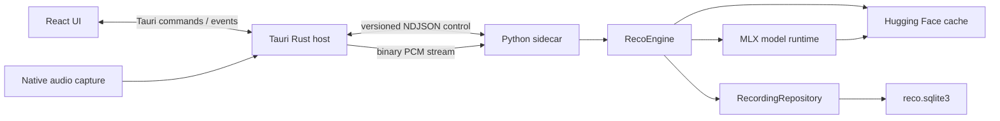

# RecoGUI アプリケーション設計

## 文書の役割

この文書は、現行実装の責務境界と、変更時に維持すべき設計上の不変条件を示す。
製品要件は [requirements.md](requirements.md)、検証方法は [validation.md](validation.md) を正本とする。

## システム構成



### 責務

| 層                  | 責務                                                          |
| ------------------- | ------------------------------------------------------------- |
| React               | 画面表示、選択、検索条件、dialog、pane幅などの表示状態        |
| Rust                | OS連携、ライブ音声取得、PCM正規化、path token、sidecar監督、lifecycle |
| Python sidecar      | controlとPCMの検証、command dispatch、event送信、非同期処理の管理 |
| RecoEngine          | GUI向け文字起こし、model lifecycle、active sessionの管理      |
| RecordingRepository | GUI用SQLite、履歴、検索、削除、Export、schema version検証     |

## リポジトリ構成

```text
RecoGUI/
├── protocol/       # NDJSON schemaと共通fixture
├── scripts/        # protocol検証などのリポジトリ用script
├── src/            # React / TypeScript
├── src-python/     # Python engine、test、import元の記録
├── src-tauri/      # Rust host、Tauri設定、sidecar launcher
├── docs/
└── package.json    # 開発と検証の共通入口
```

元のReco repositoryは参照元として保持し、変更しない。コピー元は
`src-python/SOURCE.md`に記録し、RecoGUI内のコードを以後の正本とする。

開発時は`src-python/src/reco`を編集する。Silero VADの正本は
`src-python/assets/silero_vad.onnx`に置く。Tauriの開発起動とbuildの前に、Python codeだけを
圧縮した`src-python/dist/reco-engine.pyz`を生成する。Tauri bundleにはこのarchive、VAD asset、
依存関係の`pyproject.toml`と`uv.lock`、ライセンス情報だけを含め、source tree、test、`.venv`は
含めない。

`pnpm dev`も起動前にarchiveを生成する。frontendのhot reloadはPython archiveを再生成しないため、
Python codeを変更した場合は開発applicationを再起動する。

Rustは`uv sync --no-install-project`でApplication Supportの`python-env`へ第三者依存だけを同期し、
同期後にその環境の`bin/python`で`.app`内の`reco-engine.pyz`を直接実行する。Reco package自体を
環境へinstallしないため、application更新後もarchiveが常に実行コードの正本となり、`.app`内へ
`__pycache__`を作成しない。VADは`.app`内の独立したresource pathをsidecarへ渡し、
Application Supportへ複製せずONNX Runtimeから直接読み込む。
旧versionがApplication Supportへ展開したVAD assetは参照しないが、この変更では自動削除しない。

## 状態と永続化

### 状態の正本

| 状態                                             | 正本                       |
| ------------------------------------------------ | -------------------------- |
| sidecar processの起動、停止、crash、再起動       | Rust                       |
| マイクとデスクトップ音声のcapture、PCM sequence  | Rust                       |
| model一覧、選択、active session、queue scheduler | Python engine              |
| model snapshot                                   | Hugging Face共通キャッシュ |
| 選択したrepository IDとrevision                  | GUI用SQLite                |
| 処理中のASR runtime lease                        | Python engineのprocess memory |
| 保存済みsession、segment、集計値                 | GUI用SQLite                |
| 待機中のfile queue itemと順序                    | GUI用SQLite                |
| 選択、dialog、検索条件、pane幅                   | React                      |

Reactは永続的な処理状態を独自に確定しない。起動、再接続、終端eventの後はengineと履歴から
canonical stateを取得する。

### 保存の不変条件

1. ライブ入力はRustの権限事前確認を通過してから`session.start`を行い、実capture開始前にsession rowを作成する。
2. segmentと集計値を一つのtransactionで保存する。
3. 保存成功後にだけ`segment.persisted`を送信する。
4. terminal stateを保存してから完了または失敗eventを送信する。
5. 保存を継続できない場合、未保存の認識結果だけを表示し続けない。

各sessionは`row_version`を持つ。Reactは`rowVersion`が古いresponseやeventを無視し、
segmentを`(sessionId, segmentIndex)`で統合する。同じeventが複数回届いても同じsegmentを
重複表示しない。

詳細のpage取得中に`rowVersion`が変化した場合は、先頭から読み直して一貫したsnapshotを作る。

### 終了と復旧

- StopはRust captureを停止して残りのPCMをdrainし、Pythonがopen VADとASR queueをdrainして
  terminal stateを保存する。
- Pauseも同じ順序で入力を閉じてから`paused`を保存する。pause中のwall-clock時間はsample indexへ加算しない。
- `pausing`中はactive slotとASR workerを占有し、`paused`へのcommit後だけ解放する。
- session threadは`preparing`中にruntime leaseを取得する。modelとworkerの準備後にRustへcapture開始を要求し、
  binary streamの`START`を受信してから`running`を保存する。
- Resumeはactive slotが空のときだけ、保存したmodel revision、sample offset、segment indexから
  同じsessionへ追記する。現在の既定modelへfallbackしない。
- 音声ファイルの失敗時は最後にcommit済みのsegment終端を`resume_sample`へ保存し、`failed`を
  Resumeと同じ経路でretry可能にする。未確定の入力位置はcheckpointに使用しない。
- 明示的にpauseしたライブsessionだけをResume可能とする。capture中のデバイス切断、ring overflow、
  PCM sequence gap、binary streamのEOF、native capture errorはterminalな`failed`とし、再開を許可しない。
- 新規開始のruntime取得失敗は`failed`、Resumeの取得失敗はcheckpointを維持した`paused`とする。
- 音声ファイルは保存した絶対pathとfingerprintを再検証し、先頭から同じ条件でresampleしてoffsetまで読み飛ばす。
- マイク選択は再起動をまたいで維持されるdevice IDを保存し、Rustがcapture streamを開く直前に
  解決する。IDが見つからない場合は別デバイスへfallbackしない。未指定なら開始時点の既定マイクを使う。
- デスクトップ音声はdevice IDを持たず、Resume時にもMac全体を対象とする。
- ライブ入力は新しいcapture streamを開き、pause時のsample offsetから連続する時間軸を使用する。
- 前回processの非終端sessionは起動時に`abandoned`へ変更する。
- `paused`は非終端だが復旧対象外とし、アプリ再起動後もresume可能な状態として保持する。
- sidecarが応答しない場合、Rustはprocessを終了できる。保存済み部分は履歴に残る。
- sleep、wake、出力デバイス変更後にライブ録音を無断で再開しない。

### ネイティブ音声取得

- `AudioCaptureManager`はRust host内で一つだけ生成し、同時に一つのcaptureを所有する。
- マイクは`cpal`で列挙・取得する。UIへは表示名、device ID、channel数、既定デバイスかを返す。
- デスクトップ音声はmacOS 14.2以降のCore Audio Process Tapとprivate aggregate deviceを使う。
  global tapからRecoGUI自身のprocessを除外し、`CATapUnmuted`で通常の音声出力を維持する。
- tap、aggregate device、IOProcはRAII objectが所有し、IOProc、aggregate device、tapの順に破棄する。
- realtime callbackは入力bufferを有界SPSC ringへコピーし、overflowはatomic flagで通知する。
  callback内ではallocation、blocking、resample、log出力を行わない。
- workerはchannelをdownmixし、入力sample rateとsample formatから16 kHz mono `f32`へ変換する。
  変換後の絶対sample indexを採番し、最大512 sampleのframeとしてbinary streamへ書く。
- stop時はringとresamplerをdrainし、最後の512未満のframeを送ってから`END`を送信する。
- microphone permissionはAVFoundationで明示的に事前確認する。デスクトップ音声はtapとaggregate deviceを
  短時間start/stopするprobeで事前確認し、probeのPCMを破棄する。拒否または失敗時はPythonへ
  `session.start`を送らないため、履歴は作成されない。
- Python側はライブデバイスを開かない。従来の`sounddevice`、PortAudio index解決、Python側の
  microphone inputとinput一覧commandは削除し、ファイル入力だけを直接読み込む。

### ファイル処理キュー

- `app_queue_items`は未開始ファイルだけを保持し、`app_sessions`とは分離する。
- queue itemは追加時のpathとfingerprintを保存するが、Reactへpathを返さない。
- `autoAdvanceEnabled`はPython engineのprocess-local stateとし、起動時は常にfalseとする。
- enqueue前にactive sessionと既存queue itemがどちらもなければauto advanceを有効化し、先頭を
  即時にclaimする。active sessionまたは既存itemがあればenqueueだけを行う。
- `queue.start`はidle時に先頭項目を検証し、queue itemの削除と`preparing` sessionの作成を
  同じtransactionでcommitしてから処理threadを開始する。
- claim済みitemはqueue snapshotから除外し、処理中Sessionは既存の履歴・Session UIで表示する。
- path欠損やfingerprint不一致はqueue itemを`invalid`として保存し、後続項目の検証へ進む。
- session threadはactive slotを解放してから、auto advanceが有効な場合だけ次項目を開始する。
- queue schedulerは正常な同一model revisionのruntime leaseを後続sessionへ引き継ぐ。
- queueが空になるかauto advance停止後に現行sessionが終わった時点でruntime leaseを解放する。
- Pause、Stop、sleep、quitは次項目とのraceを避けるため、先にauto advanceを停止する。
- paused file sessionのResume中はqueueを停止し、そのsessionの自然完了後にだけ以前の自動進行を
  再開する。
- queueの並べ替えはrevision付きの全item ID順をtransactionで置換し、stale revisionを拒否する。

## IPC

engine protocolは互換性を持たないversion 2とし、control planeとaudio data planeを分離する。

### Control plane

RustとPython sidecarはstdin/stdout上のUTF-8 NDJSONでcommandとeventを通信する。

- stdoutはprotocol専用、stderrはlog専用とする。
- messageには`protocolVersion`、`requestId`、`sequence`を持たせる。
- 新規ライブsessionではRustがUUIDを生成し、`session.start`のenvelopeへ同じ`sessionId`を設定する。
- sessionに関係するmessageには`sessionId`を持たせる。
- protocol version、sequence、request correlation、message sizeを検証する。
- Reactから呼べる操作はRustの個別Tauri commandに限定する。
- Rust側の`ALLOWED_ENGINE_COMMANDS`をhostからsidecarへ送信できるcommandの正本とする。
- `audio.captureRequested`と`audio.captureStopRequested`はPythonからRustへの内部eventとし、Reactへ転送しない。
- Pythonはmodel準備後に`audio.captureRequested`を送り、対応するbinary `START`または`ERROR`を待つ。
  Rustは停止要求を受けたらcaptureをdrainし、`END`または`ERROR`を送る。

### Audio data plane

sidecar起動ごとに`UnixStream::pair()`を生成し、RustからPythonへの一方向binary streamとして使用する。
子process側はFD 3へ割り当て、`--audio-fd 3`で通知する。filesystem上のsocketは作らず、sidecar再起動時に
新しいpairへ交換する。

各recordは次の64 byte little-endian headerとpayloadからなる。

| offset | field           | type       | 内容                                      |
| -----: | --------------- | ---------- | ----------------------------------------- |
|      0 | magic           | `[u8; 4]`  | `RPCM`                                    |
|      4 | version         | `u16`      | audio wire version 1                      |
|      6 | kind            | `u16`      | `START`、`DATA`、`END`、`ERROR`            |
|      8 | session ID      | `[u8; 16]` | UUID                                      |
|     24 | generation      | `u32`      | 新規captureまたはResumeの世代             |
|     28 | sequence        | `u64`      | generation内で連続するrecord番号          |
|     36 | start sample    | `u64`      | sessionの16 kHz時間軸上の絶対開始sample   |
|     44 | sample rate     | `u32`      | `16000`                                   |
|     48 | channels        | `u16`      | `1`                                       |
|     50 | sample format   | `u16`      | `1` = `f32le`                             |
|     52 | sample count    | `u32`      | `DATA`のsample数、最大512                  |
|     56 | payload length  | `u32`      | 後続payloadのbyte数                        |
|     60 | flags           | `u32`      | version 1では予約済み                      |

- `START`と`END`はpayloadを持たない。
- `DATA`のpayload長は`sample count * 4`と一致させる。512未満の`DATA`は`END`直前の最終recordだけに許可する。
- `ERROR`は4 KiB以下のUTF-8 JSONで、安定した`code`と表示用`message`を持つ。
- generationは明示的なResumeごとに増加し、sequenceはgenerationごとにresetする。start sampleはgenerationを
  またいで連続するsession絶対位置とする。
- Pythonは部分headerと部分payloadをbufferし、magic、version、session、generation、sequence、sample位置、
  rate、channels、format、count、lengthを検証する。不一致、欠落、予期しないEOFを音声欠落として失敗させる。

### Commands

```text
engine.getState
engine.shutdown
model.getState
model.list
model.select
session.start
session.stop
session.pause
session.resume
queue.getState
queue.enqueueFiles
queue.reorder
queue.remove
queue.clear
queue.start
queue.pause
history.list
history.get
history.search
history.rename
history.delete
history.deleteMany
history.export
history.exportMany
history.cancelExport
```

### Events

```text
engine.heartbeat
session.progress
session.stateChanged
segment.persisted
session.completed
session.failed
queue.changed
history.changed
export.progress
export.completed
operation.failed
engine.exited
```

`host://close-requested`と`host://close-force-required`はengine protocolではなく、
application終了を調停するhost eventである。

マイク一覧はsidecar commandではなくRustの個別Tauri commandが直接返す。

`ModelState.status`は`unselected`、`unavailable`、`ready`、`error`だけを返す。
`ready`は選択revisionがcacheに存在して処理開始を試行できることを表し、model読込済みや
MLX互換性確認済みを意味しない。runtimeの読込中はsessionの`preparing`で表す。

protocolを変更するときは、Python、Rust、TypeScriptと`protocol/fixtures/`を同時に更新する。
旧protocol、旧Python microphone input、旧`audio.listInputs`への互換層は設けない。

## SQLite

GUI用databaseはTauriのapplication data directoryにある`reco.sqlite3`とする。
RustとReactはこのdatabaseを直接開かない。

- `app_sessions`、`app_segments`、`app_queue_items`を中心に保存する。
- `app_session_search`のFTS5 indexで履歴を検索する。
- foreign keysと`ON DELETE CASCADE`でsessionとsegmentの整合性を保つ。
- WAL、busy timeout、durabilityを優先するsynchronous設定を使用する。
- 現行schema versionだけを受理し、旧versionは起動時に拒否する。
- Exportは一貫した読み取り結果から作り、一時pathから最終pathへ置き換える。

## UI

- 左の履歴paneと右のsession paneを常設する。
- 新規session dialogは`マイクで録音`、`デスクトップ音声を録音`、`音声ファイルを選択`の
  三つを同じ階層で表示する。
- source kindは`file`、`microphone`、`systemAudio`を明示的に扱い、未知の値をマイクへfallbackしない。
- 履歴、filter、source badgeで`デスクトップ音声`を区別する。
- 設定ではマイクのdevice IDだけを永続化し、デスクトップ音声のdevice設定は追加しない。
- 履歴paneは280pxから420pxの範囲でpointerとkeyboardから変更できる。
- 処理中sessionを表示したまま別の履歴を閲覧できる。
- 単一選択と複数選択を分け、複数選択では一括Exportと削除を提供する。
- 単一セッションの右クリックメニューから名前を変更し、SQLiteとFTS5 indexを同一transactionで更新する。
- 削除前に確認し、処理中sessionは先にStopまたはCancelする。
- live transcriptの自動追従は、ユーザーが上へscrollしたとき停止する。
- dialogを閉じた後は呼び出し元へfocusを戻す。
- 状態とerrorを色だけで表現しない。
- animationは`prefers-reduced-motion`を尊重する。

## ファイルとモデル

Rustはnative dialogで選択したpathをtoken化し、Reactへ任意pathの権限を渡さない。
Pythonへ渡す前にもtokenと操作内容を検証する。

複数ファイルのtokenはenqueue時にRustがpathへ解決する。tokenはprocess内だけで使用し、
databaseへ保存しない。

- マイクとデスクトップ音声の元音声は保存しない。RustとPython間のPCMもmemory内だけで扱う。
- 入力ファイルの絶対pathはresume専用にSQLiteへ保存し、ReactやExportへ含めない。
- ASR modelはアプリ外でHugging Face共通キャッシュへ保存する。
- Python engineはHugging Face Hubのcache APIを読み取り専用で使用し、`repo_type` が`model`の
  すべてのrevisionを候補とする。
- 選択のrepository IDとrevisionはSQLiteに保存し、snapshot pathは毎回一覧から解決する。
  snapshot pathはReactやdatabaseへ公開しない。
- `ModelManager`はcache列挙、snapshot pathの解決、既定model選択だけを担当し、model読込と
  worker生成を行わない。
- `ModelManager`は各snapshotの`config.json`から`support_languages`を読み、UIとengine validationへ
  同じcanonical language listを渡す。
- 言語設定は`null`を自動、canonical language nameを明示指定として扱う。自動ではmodel APIへ
  languageを渡さず、返された検出言語を`app_segments.language`へ保存する。
- model選択はactive sessionとqueue自動処理がないときに許可する。paused sessionがあっても
  切替可能だが、そのResumeではsession自身に保存したmodelとrevisionを使用する。
- `RecoEngine`はmodel revision単位のruntime leaseを専用lockで取得、再利用、解放する。
  loadとunloadの間はengine全体のstate lockを保持しない。
- 解放はworker停止、serviceとmodelの参照破棄、`gc.collect()`、`mlx.core.clear_cache()`まで行う。
  cache再一覧はactive leaseを途中で閉じない。
- `app_sessions.language`は明示言語または`Auto`を保持し、`detected_languages_json`はsession内で
  検出された言語を保持する。任意文字列は選択modelの対応言語と照合して拒否する。
- Silero VADは`.app`内の独立した同梱assetとしてhashを検証し、Hugging FaceのASR model管理と
  Application Supportへの保存から分離する。
- logはapplication data directoryの`logs/`へ保存する。
- 履歴削除は入力元ファイルや既存のExportを削除しない。

## 変更時の確認事項

- protocol変更: schema、fixture、Python、Rust、TypeScriptを更新する。
- 音声変更: realtime callbackの制約、sample continuity、overflow、最終drain、native resourceの
  逆順破棄、元音声の非保存を確認する。
- 保存変更: commit-before-display、row version、cascade delete、crash recoveryを確認する。
- UI変更: keyboard操作、focus復元、selection維持、reduced motionを確認する。
- lifecycle変更: eager load、runtime lease、queue handoff、Resume model、capture handshake、二重解放、
  deadlock、sidecar exit、audio EOF、hang、sleep、close、restartを確認する。
- CLI変更: GUIとは別経路、別databaseであることを前提に互換性を確認する。
